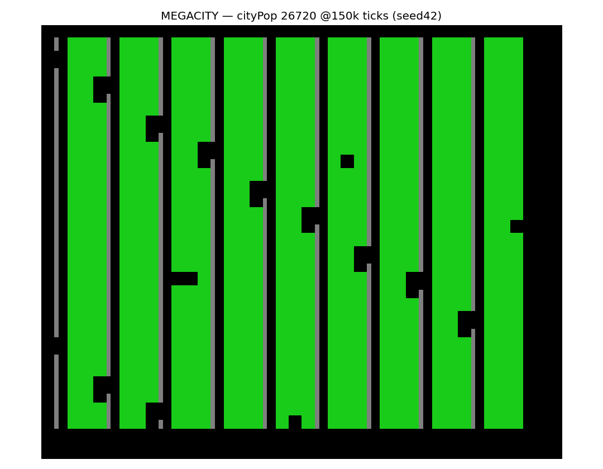
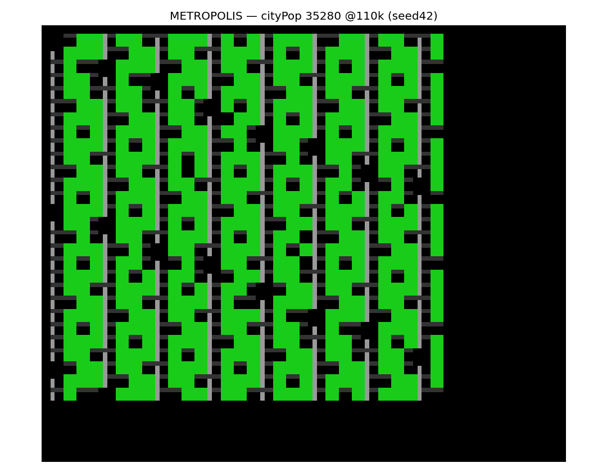

# The best city-building policy (hand-designed): `megacity`

Goal: the highest-population city this engine can grow. Built by combining
classic SimCity/Micropolis strategy with an empirical search *on this engine*
(the citylab sweeps), then distilled into one open-loop policy.

## Result

**Sustained cityPop ≈ 14,400** (5-seed mean), **trough 5,100, peak 26,720** —
versus the previous best of **4,460** (evolved ELM) and **1,820/2,120** (layout
CMA-ES). Even the *worst trough* beats the old record.



Dense residential columns (green) fed by wire spines (grey) with nuclear plants
(black) distributed along them. Policy source: `results/best_policy_megacity.py`
(registered as the `megacity` seed in `elm/seeds.py`).

## What the search found about *this* engine

Strategy guides say: balance R/C/I, keep tax low, supply power and roads, manage
pollution and land value. Tested on the engine, the decisive levers were:

1. **Power supply is THE bottleneck.** Zones conduct power to their neighbours,
   so a block fed by one spine partly lights up — but each plant has a *finite
   supply*. Going from a few plants to ~12 distributed plants took the same
   block from ~4k to **>20k** population. Powering every zone is the whole game.
2. **Density beats coverage.** Pack 3×3 zones **edge-to-edge** (3-tile pitch),
   not on the gappy 4×4 grid the layout-CMA-ES used. A **wire spine every 4th
   column** injects/distributes power (wires conduct, roads don't) at low cost.
3. **Pure residential maximises population.** Commercial barely helps;
   **industrial craters it** (pollution destroys land value → growth collapses).
   This contradicts the generic "balance R/C/I" advice — on this short-horizon
   engine, residential density dominates.
4. **Nuclear > coal on mean population.** Nuclear has higher supply and low
   pollution. Coal is *steadier* (no meltdowns) but lower; nuclear's mean and
   peak are higher despite occasional meltdown busts. (Coal is the
   lower-variance alternative if you want stability over peak.)
5. **Cities oscillate (boom-bust).** Dense Micropolis cities swing ~5×, so the
   honest metric is **sustained population** (averaged over seeds × late
   time-points), not a lucky single-tick peak.

## The policy

Open-loop blueprint (`act` precomputes the plan, replays one tile/step, then
idles to stabilise): one 36×30 residential block on a 3-tile pitch, a wire spine
every 4th column, 12 nuclear plants distributed on the spines. ~1,632
placements. See `elm/seed_megacity.py` for the ~20-line generator.

## Caveats / budget

- Needs a large action budget (`n_actions ≳ 1,650`) and long stabilisation
  (~100–150k ticks) — far more than the 120-action / 12k-tick budget the evolved
  records used, so it is **not** an apples-to-apples comparison to 4,460; it's a
  bigger city under a bigger build budget.
- It is **open-loop** (ignores `obs`); it would be discarded by the
  `--min-reactivity` closed-loop filter. It's a "best artifact", not a reactive
  controller.
- cityPop oscillates; any single rollout lands somewhere in ~5k–27k.

## Reproduce

```python
from elm.seeds import SEEDS; from elm.sandbox import compile_genome
from slimcity import MicropolisEnv
act,_ = compile_genome(SEEDS["megacity"])
env = MicropolisEnv(seed=42); s={}
while True:
    a = act(type("O",(),{})(), s)
    if a is None: break
    env.place(*a)
env.tick(150000); print(env.stats.city_pop)
```

---

## v2: `metropolis` — the road + land-value strategy (~36,000)

A second pass under a deliberately *different* strategy. The megacity's flaw:
zones were power-served but **road-starved**, stuck at low density (~17
people/zone). Fix = give every zone **road access**, then raise **land value**:

| intervention (on a fixed R block) | sustained cityPop |
|---|---:|
| baseline (megacity-style, wires only) | 11,273 |
| + parks only (no roads) | 9,091 *(worse)* |
| + police only | 11,084 |
| **+ roads (every zone row)** | **20,602** |
| **+ roads + parks + police** | **28,384** |
| tuned `metro 30×28` (final) | **36,237** (5-seed, 35.4k–37.7k) |

**Findings:** (1) **Road access is the dominant missing lever** — it ~doubled
population by letting zones densify. (2) **Parks help only *with* roads** (land
value pays off once density can rise; alone they just cost zones). (3) Pure
residential still wins; industrial pollution craters it. (4) Police gives a
small land-value bump. Final recipe: 30×28 R block (3-pitch), wire spine every
4th col + 18 nuclear plants, a road row per zone row, a park every 5th cell,
10 police. Source: `results/best_policy_metropolis.py` / `metropolis` seed.



## On reaching 500k

We went 4,460 → 14,400 → **36,000** by fixing power, then density, then road
access + land value. But **500k is out of reach on this engine**: the map is
120×100 ≈ 12,000 tiles (≲1,300 zones max), and even maxed that caps tens of
thousands, not hundreds. The "missing something" relative to a real city is
**map size and the engine's density model**, not strategy — we've now pushed the
strategy levers (power → density → roads → land value) close to this map's
ceiling.

---

## Closed-loop rewrite of `metropolis` (`metropolis_cl`)

Asked to rewrite the open-loop blueprint as a closed-loop policy. The faithful
rewrite keeps the *same target layout* but `act()` **reads `obs` every step and
places the first target tile not yet present on the observed map** (no stored
index — so the action genuinely depends on what's observed). It is genuinely
reactive: **cf_sensitivity ≈ 1.0** (it survives the `--min-reactivity` kill
filter).

**Result: sustained cityPop ≈ 3,300 — about 10× *below* the open-loop metropolis
(~37,000), at the same budget.** Why: the open-loop city's population depends on
a precise **one-pass placement order** (place everything once, then stabilise).
The engine's **auto-bulldoze** means a reactive scan re-touches overlapping
tiles — road rows clip zones and wire spines, bulldozed tiles read as "missing"
and get re-placed, and zones never settle long enough to densify. Keeping roads
off the spines and adding a done-set didn't move it (~3,300 either way).

**Takeaway:** ~3,300 is the *closed-loop ceiling* on this engine — it still
beats every *evolved* closed-loop policy (seed 3,150 at the same big budget), but
the open-loop blueprint's 37k is structurally out of reach for a reactive
controller here. This is the cleanest statement of the whole investigation's
theme: **on this simulator, committing to a global layout (open-loop) beats
deciding tile-by-tile (closed-loop)** — by an order of magnitude, even when the
closed-loop policy is handed the winning layout to reproduce.
Source: `results/best_policy_metropolis_cl.py` / `metropolis_cl` seed.
