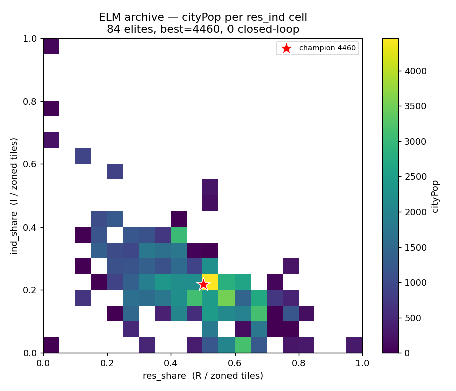

# ELM diverse-seed run — strategy diversity & the closed-loop question

A long ELM (code-genome MAP-Elites with Claude as the variation operator)
run launched from a **deliberately diverse starting population**, then mined
for the *kinds* of strategies that emerged and whether any of them are
genuinely closed-loop.

- **Config:** `--operator claude --model claude-sonnet-4-6 --temperature 1.0`,
  `--measures res_ind --fitness dense --crossover-rate 0.3 --n-evals 5`.
- **Seeds (9, spanning behavior space):** `plan` (R-only spine), `industrial`,
  `commercial`, `mixed` (R/C/I), `res_ind` (R+I), `res_heavy`, `twin` (two
  separated neighborhoods), `reactive` (obs-driven, the only closed-loop seed),
  plus `random`. See `elm/seeds.py`.
- **Compute:** ~1,160 LLM iterations across three segments (the ephemeral
  container recycled twice; each time the run resumed from its checkpoint via
  the new `--init-archive` flag).
- **Artifacts:** `results/elm_diverse_overnight.npz` (archive),
  `results/elm_diverse_overnight_best.py` (champion),
  `results/elm_diverse_overnight_generations.jsonl` (every genome generated),
  `docs/elm_diverse_heatmap.png`. Reproduce the analysis with
  `python3 -m elm.analyze_run results/elm_diverse_overnight.npz --png docs/elm_diverse_heatmap.png`.

## Headline

**New global champion: cityPop ≈ 4,460** — roughly **2.4× the previous best**
(layout-CMA-ES 1,820, prior ELM 1,792).

| metric | value |
|---|---|
| best cityPop (run, mean of 5 rolls) | **4,460** |
| **replay-verified** (8 fresh seeds) | mean **4,085**, min 2,740, max 4,820, std 625 |
| best fitness | 4,516 |
| archive cells filled | 84 / 400 (coverage 21%) |
| QD-score | 104,067 |
| champion origin | **crossover** (iter 95) |

The replay spread (±~15%) is the engine's known per-process non-determinism,
mitigated in selection by `--n-evals 5`. Even the *minimum* replay (2,740)
beats every prior approach.

## Behavior-space map



cityPop per `res_ind` cell (x = residential share of zoned tiles, y =
industrial share). There is a clear **"valley of viable cities"**: a diagonal
band at moderate residential share (0.4–0.7) and low-to-moderate industrial
share (0.1–0.3). The champion (★) sits at its bright peak, (0.50, 0.22) — a
city that is roughly half residential, a quarter industrial, the rest
commercial. **The corners are dark:** pure-R, pure-I and pure-C cities all
collapse to low population, because the engine needs housing *and* jobs
(industry/commerce) to grow either.

## Two kinds of diversity — and only one of them is real

This run separates cleanly along two axes:

- **Behavioral diversity: high.** The archive spans `res_share` 0.00→1.00 and
  `ind_share` 0.00→1.00 — every zone mix from pure-residential to
  pure-industrial is represented, and the diverse seeds spread the front
  immediately. 84 distinct cells, QD-score 104k.
- **Structural (algorithmic) diversity: essentially zero.** **0 of 84 archive
  elites are closed-loop.** Across the *entire* 1,168-genome trajectory only
  **5 (0.4%)** ever read simulation feedback — and those five are the
  hand-written `reactive` seed and a handful of its early descendants. The
  operator abandoned reactive code within the first few iterations.

So the population is diverse in *what city it builds*, not in *how it decides
what to build*. Every winner is an **open-loop blueprint generator**: on the
first `act()` call it precomputes a fixed list of `(tool, x, y)` placements and
then replays it one per step, **ignoring `obs` entirely**.

## Are any of them actually closed-loop? — No.

| policy class | # genomes | share | best cityPop | mean cityPop |
|---|---:|---:|---:|---:|
| open-loop (ignore sim feedback) | 1,163 | 99.6% | **4,460** | 432 |
| closed-loop (read `obs.tile_map`/metrics) | 5 | 0.4% | 276 | 105 |

The best closed-loop genome (cityPop **276**) *is the `reactive` seed itself*.
Its descendants either dropped the obs-reactivity or were dominated and never
won a cell. When Claude was free to optimize for population, it consistently
discovered that an **open-loop blueprint beats a reactive controller** on this
task — and converged there fast.

This **nuances the repo's earlier ELM framing** ("a closed-loop policy in code
form"). With a diverse seed front and enough iterations, ELM's *winning* code
is open-loop. The LLM's strength here isn't closed-loop control — it's that it
can author and recombine large, structured, *correct* fixed blueprints
(hundreds of coordinated placements) that neither CMA-ES vectors nor reactive
nets could express.

## Strategy archetypes

### A. Multi-district powered-spine blueprint + civic services — *the winner family*

The dominant archetype (62/84 elites, including the top 12). Precompute several
**neighborhood centers**; for each, lay a coal plant + a horizontal **wire**
spine (wires conduct power; roads don't) + flanking **road** rows, then pack
**dense mixed R/C/I** zone rows above and below. Tie all plants together with a
map-spanning wire line, add connecting roads, and sprinkle **fire/police
stations + stadiums** (the services unlock further growth). Champion (cityPop
4,460) abridged:

```python
def act(obs, state):
    if "plan" not in state:
        plan = []
        neighborhoods = [(20, 35), (60, 35), (100, 65)]          # district centers
        zone_cycle = [Tool.RESIDENTIAL, Tool.COMMERCIAL, Tool.INDUSTRIAL,
                      Tool.RESIDENTIAL, Tool.RESIDENTIAL, Tool.COMMERCIAL]
        for idx, (cx, cy) in enumerate(neighborhoods):
            plan.append((Tool.COALPOWER, cx - 2, cy))            # plant feeds the spine
            for dx in range(-1, 22):
                plan.append((Tool.WIRE, cx + dx, cy))            # powered spine
                plan.append((Tool.ROAD, cx + dx, cy + 1))        # road access
                plan.append((Tool.ROAD, cx + dx, cy - 1))
            for row in [-3, -6, -9, -12, 4, 7, 10, 13]:          # dense zone rows
                for k, dx in enumerate(range(0, 21, 3)):
                    plan.append((zone_cycle[(k + idx) % 6], cx + dx, cy + row))
        for x in range(120):
            plan.append((Tool.WIRE, x, 49)); plan.append((Tool.ROAD, x, 50))  # trunk line
        for pos in [(Tool.FIRESTATION, 10, 20), (Tool.POLICESTATION, 30, 20),
                    (Tool.STADIUM, 55, 90), ...]:                # civic services
            plan.append(pos)
        state["plan"] = plan; state["i"] = 0
    i = state["i"]; state["i"] = i + 1                            # replay, one/step
    return state["plan"][i] if i < len(state["plan"]) else None
```

Champion city (one district, ASCII; `*`=plant `=`=wire/road, R/C/I=zones):

```
.........RRCIIRRRCCR.....
.........RRCIIRRRCCR.....
.........RRCIIRRRCCR.....
.........*===========....   <- coal plant + horizontal wire/road spine
..........===========....
.........IIRRRCCRCII.....
.........IIRRRCCRCII.....
```

### B. Compact single-spine neighborhood — *the seed lineage*

The un-scaled SEED_PLAN family: one plant, one spine, flanking zones. Same
open-loop blueprint pattern at smaller scale — cityPop ~300–1,800. This is what
the multi-district winners grew out of, via mutations that *duplicated the
district* and crossovers that *merged two districts and added services*.

### C. Pure-mix extremes — *the dark corners*

R-only, I-only and C-only blueprints (the `plan`/`industrial`/`commercial`
seeds and their variants). They hold the edges of the heatmap for coverage but
top out at low population — the engine punishes unbalanced zoning (no jobs, or
no housing → no growth). Open-loop.

### D. Obs-reactive builder — *the road not taken (closed-loop)*

The only closed-loop strategy in the whole run. Builds a spine, then **reads
`obs.tile_map`**, finds live wire tiles with `np.where(wire_mask(tm))`, and
drops a residential zone next to each so every zone is adjacent to working
power:

```python
    tm = obs.tile_map
    ys, xs = np.where(wire_mask(tm))            # react to what's already powered
    for wy, wx in zip(ys.tolist(), xs.tolist()):
        zx, zy = wx - 3, wy
        if (zx, zy) not in state["placed"]:
            state["placed"].add((zx, zy))
            return (Tool.RESIDENTIAL, zx, zy)
    return None
```

Genuinely closed-loop, conceptually appealing — and **evolutionarily a dead
end here**: max cityPop 276, dominated immediately, 0 surviving elites.

## Takeaways

1. **A diverse seed front works.** Pre-spreading the population across behavior
   space gave crossover diverse material to recombine — and **every top-12 city
   is a crossover**, mostly "merge two districts + add services."
2. **The peak is open-loop.** Freed to optimize, the LLM authors big fixed
   blueprints, not controllers. On this sparse-reward, one-tile-at-a-time task,
   committing to a good global layout beats reacting step-by-step.
3. **Services and balance are the unlock.** The bright cells all combine
   balanced R/C/I (≈0.5/0.25/0.25) with fire/police/stadium coverage; the dark
   cells are unbalanced or service-free.
4. **Closed-loop remains the hard regime** — even with an LLM mutator. The one
   reactive lineage never competed. Making closed-loop win would likely need it
   to be *protected* (its own QD measure / niche) rather than thrown into open
   fitness competition with blueprints.

## Caveats

- The static open/closed-loop classifier (`elm/analyze_run.py`) keys on AST
  access to `obs` feedback fields; the `n_plants` feature counts source tokens,
  so plants placed inside a loop are under-counted (some "single-district"
  labels are really loop-built multi-district). The open/closed-loop verdict is
  robust; the district-count buckets are approximate.
- cityPop carries ~15% per-process replay noise; all headline numbers are
  `--n-evals`-averaged and the champion is separately replay-verified above.
